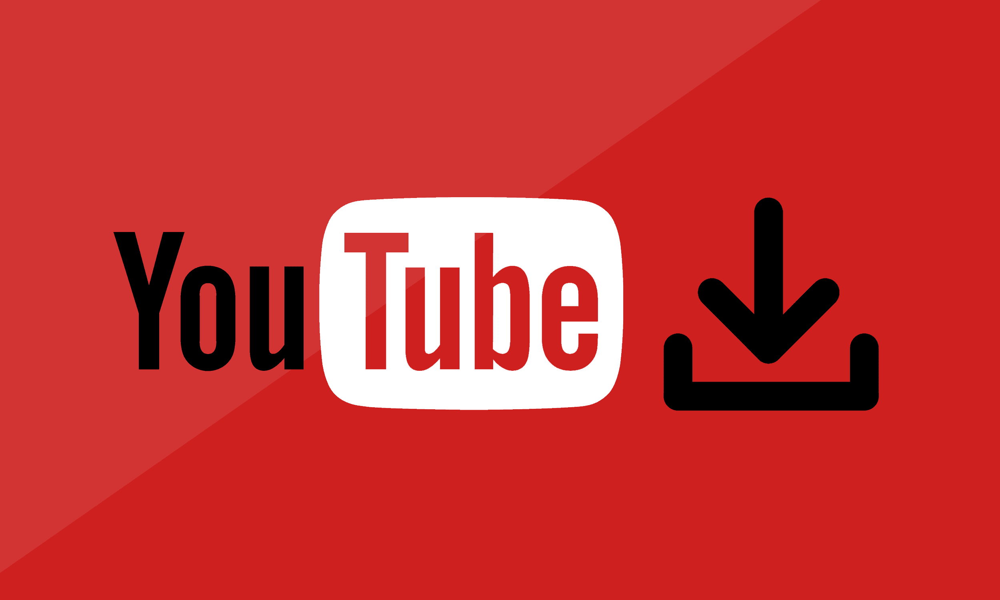

> [!CAUTION]
> ### This tool is intended for personal, educational, or archival use only. Do not use or distribute it for commercial purposes or host it as a public service. Downloading copyrighted content from YouTube may violate their Terms of Service.

> [!IMPORTANT]
> ### Use this software only for private use. Do not operate or share this as a public downloader. Respect YouTube’s Terms of Service and copyright laws.

---


# 🎵 DevLuxe - YouTube Downloader (v1.6.1)

A simple, user-friendly YouTube MP3/MP4 downloader with a PyQt6 graphical user interface.  
Downloads audio & video's from YouTube videos or playlists with selectable bitrate quality.

---

## Features

- Download audio from YouTube videos (MP3, M4A, OPUS, WAV, or keep the original audio container)  
- Download video (MP4) - merges best video + best audio automatically  
- Optionally embed metadata (ID3) and embed/save thumbnails (cover art)  
- Selectable audio quality: 128, 192, 256, or 320 kbps  
- Real-time progress display and detailed log output  
- Stop/cancel ongoing download at any time  
- Multi-language interface (English & German) with tooltips  
- Dark theme powered by `qdarkstyle`
---
### A proper installer will be available soon. The tool will then be launchable via a single `.exe`. However, you will still need to set the PATH for FFmpeg yourself - either through a batch file or manually (your choice).

---

## Requirements

Before running the application, ensure the following prerequisites are installed on your system:

- Python packages (install via `pip`):  
  - `yt-dlp`  
  - `PyQt6`  
  - `qdarkstyle` (optional)  
- **FFmpeg** installed and available on your system PATH - required for audio extraction, conversion and thumbnail embedding. 

---

## Setup Instructions

### 1. Clone or Download the Repository

Download or clone this repository to your local machine:

```bash
git clone https://github.com/mambuzrrr/YouTube_Downloader.git
cd YouTube_Downloader
```

### 2. Install Python Dependencies

Install the required Python packages with pip:

```bash
pip install -r requirements.txt
```
The ```requirements.txt``` includes:
```bash
yt-dlp
PyQt6
qdarkstyle
```
### 3. Install FFmpeg (Audio Converter)

FFmpeg is essential for converting YouTube audio streams into MP3 files. The program calls FFmpeg internally during the download process.
#### Windows Users: Recommended Installation via Batch Script
We provide a convenient batch script setup_ffmpeg.bat that will:

 - Download the latest FFmpeg full build archive (7z format) from a trusted source

 - Extract FFmpeg to ```C:\ffmpeg```

 - Add FFmpeg's ```bin``` directory to your system PATH environment variable automatically

#### How to use the batch script:

1. Install 7-Zip if not already installed, from https://www.7-zip.org/
The script expects 7-Zip's command line tool (```7z.exe```) at ```C:\Program Files\7-Zip\7z.exe```.
If you installed 7-Zip elsewhere, edit ```setup_ffmpeg.bat``` and update the path accordingly.

2. Run ```setup_ffmpeg.bat``` by double-clicking it or running it in a Command Prompt with administrator rights.

3. After the script finishes, restart your computer or open a new Command Prompt window to ensure the updated PATH variable is loaded.

4. Verify FFmpeg installation by running:
```bash 
ffmpeg -version
```
You should see FFmpeg version info printed.
#### Alternative FFmpeg Installation
If you prefer manual installation, download FFmpeg from https://ffmpeg.org/download.html and add the ```bin``` folder to your system PATH manually.

---

## How to Use the Downloader
Run the application:
```bash
python YT-DL.py
```
- The GUI will open. Paste a YouTube video or playlist URL into the text field.
- Select the output folder where MP3 files should be saved. Default is your current working directory.
- Choose your preferred MP3 bitrate quality from the dropdown (128 to 320 kbps).
- If downloading a playlist, check the Download playlist checkbox.
- Click Start Download to begin.
- Watch real-time status updates and logs in the output window.
- You can stop the download at any time with the Stop button.
- Switch the interface language between English and German using the dropdown at the top right.

--- 

## Important Notes

- The downloader now supports both **audio** and **video** output:
  - Audio formats: **MP3, M4A, AAC, OPUS, WAV, FLAC, ALAC, OGG** (conversion requires FFmpeg).
  - Video format: **MP4** (downloads best video + best audio and merges them with FFmpeg). You can choose the target resolution in the UI (Auto / 360p / 480p / 720p / 1080p / 1440p / 2160p).
- **FFmpeg is required** and must be installed and available on your system `PATH` for audio conversion, metadata embedding, thumbnail embedding, and merging video+audio into MP4.
- The app stores a single settings file in the user home (e.g. `~/.brejax_settings.json`) to persist preferences (last folder, format, bitrate, resolution, checkboxes). **No per-download JSON files** are written by default.
- If a selected MP4 resolution isn't available for a particular video, `yt-dlp` will select the closest available stream that matches your choice.
- This tool runs locally - no uploads to third-party servers. Use it only for private, educational, or archival purposes and respect YouTube's Terms of Service and copyright law.
- If you see FFmpeg-related errors, verify `ffmpeg -version` works in a terminal and that the executable is on your PATH.

---

## Troubleshooting
Error: ```'ffmpeg' not found```
This means FFmpeg is either not installed or not in your system PATH.
Run the batch installer or manually install and add FFmpeg to PATH.

#### Download fails or hangs
 - Check your internet connection.
 - Verify that the URL is correct and publicly accessible.

#### No audio output or corrupted files
 - Verify FFmpeg is functioning correctly by running ```ffmpeg -version``` in a terminal.

#### Permissions issues saving files
 - Ensure you have write permissions to the output folder you selected.

---

## Changelog (Sep 09.) Version 1.6.1
**Whats new / improved**
- MP4 resolution selection - choose resolution for video downloads (Auto / 360p / 480p / 720p / 1080p / 1440p / 2160p). The app maps the selected label to a `yt-dlp` format string and merges best video + best audio using FFmpeg.
- Expanded audio codec support - added AAC, FLAC, ALAC, OGG (in addition to MP3, M4A, OPUS, WAV). 
- resolution dropdown visibility toggles automatically for non-MP4 formats.
- Multi-format audio support: MP3, M4A, OPUS, WAV, and option to keep original audio container.
- Option to embed metadata (ID3) and embed/save thumbnails.
- Added WAV output option.
- Safer filename handling: sanitized titles and unique filename generation to avoid overwrites.
- FFmpeg detection at startup, clear warning if missing.
- Clipboard auto-paste for URL on startup.
- Settings persistence: last folder, quality, format and checkboxes saved in `~/.brejax_settings.json`.
- Restored & extended UI tooltips (English & German) via `language.py`.
- Small UX fixes: clear logs at new download start, cleaner threading & cleanup.

**Notes**
- FFmpeg is still required for MP3 extraction and for merging MP4. Ensure `ffmpeg` is on PATH.

---

## Contributions
Feel free to submit issues or pull requests. Contributions are welcome!

---

### Contact
Developed by Brejax (Rico). For questions or support, open an issue or contact me directly.
