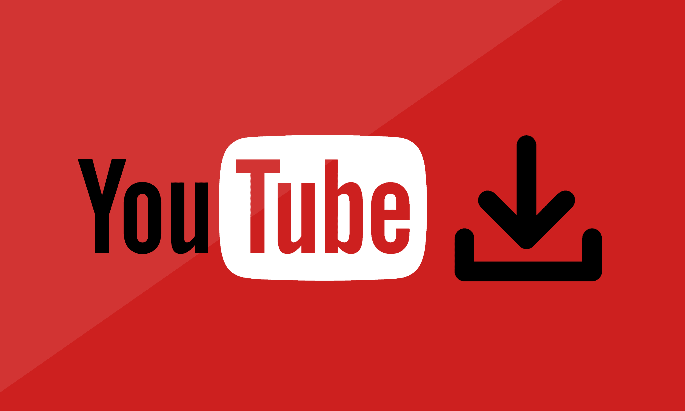

> [!CAUTION]
> This tool is intended for personal, educational, or archival use only. Downloading copyrighted content from YouTube may violate YouTube's Terms of Service and local copyright law.

> [!IMPORTANT]
> Use this software only as a local desktop tool. Do not run or distribute it as a public download service.

---

# DevLuxe - YouTube Downloader

A cleaner PyQt6-based YouTube downloader for audio and video workflows.

It supports:

- audio downloads with multiple output formats
- MP4 video downloads with selectable target resolution
- metadata and thumbnail embedding
- playlist support
- real-time log output and progress tracking
- English and German UI text

---

## Features

- Download audio from YouTube videos or playlists
- Output formats: `MP3`, `M4A`, `AAC`, `OPUS`, `WAV`, `FLAC`, `ALAC`, `OGG`
- MP4 video download with automatic video+audio merge
- Resolution presets from `360p` up to `2160p (4K)`
- Optional metadata embedding
- Optional thumbnail saving / embedding
- Persistent settings in `~/.brejax_settings.json`
- Dark UI with improved progress and status feedback

---

## Requirements

Install Python dependencies:

```bash
pip install -r requirements.txt
```

Required packages:

- `yt-dlp`
- `PyQt6`
- `qdarkstyle` (optional, but recommended)

You also need:

- `FFmpeg` available in your system `PATH`

FFmpeg is required for:

- audio conversion
- metadata embedding
- thumbnail embedding
- MP4 merging

---

## Run

```bash
python YT-DL.py
```

---

## FFmpeg Setup

Windows users can use:

```bash
setup_ffmpeg.bat
```

Or install FFmpeg manually and ensure this works in a terminal:

```bash
ffmpeg -version
```

---

## Notes

- If a selected MP4 resolution is unavailable, `yt-dlp` falls back to the nearest matching stream.
- If the settings file becomes corrupted, the app restores defaults and keeps a backup as `.broken`.
- The downloader runs locally and does not upload your data to third-party servers.

---

## Troubleshooting

### FFmpeg not found

Install FFmpeg and make sure `ffmpeg -version` works in your shell.

### Download fails

- Check the URL
- Check your internet connection
- Check whether the target folder exists and is writable

### Playlist aborted for low disk space

The app estimates playlist size before download and stops if free disk space looks unsafe.

---

## Author

Developed by **Brejax (Rico)**.
